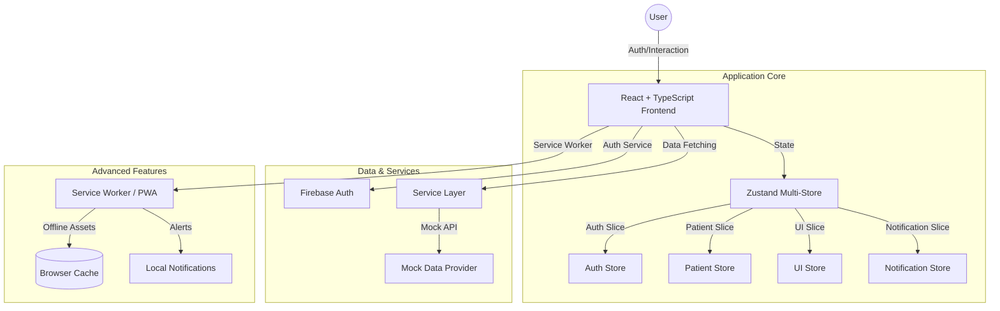

# 🏥 HealthOS

**HealthOS** is a premium B2B Healthcare SaaS platform built with **React**, **TypeScript**, and **Firebase**. It provides healthcare providers with a unified dashboard for patient management, real-time analytics, and critical notification handling.

---

## 🚀 Key Features

- **🔐 Secure Authentication**: Integrated with Firebase Auth, featuring robust validation and protected routing.
- **📊 Real-time Analytics**: Interactive dashboards using Recharts to monitor patient admissions, department distribution, and treatment outcomes.
- **🏥 Patient Management**: Advanced patient module with:
  - **Dynamic Views**: Toggle between high-density List View and visual Grid View.
  - **Smart Filtering**: Multi-parameter search and department-based filtering with debounced updates.
  - **Detailed Profiles**: Comprehensive patient medical history and clinical notes modal.
- **🔔 Notification System**: 
  - **In-app Notifications**: Custom-built notification panel with real-time critical alerts.
  - **PWA Ready**: Integrated Service Worker for offline capability and push notification support.
- **🛡️ Session Security**: Automatic inactivity monitoring with session expiry warnings after 25 minutes.

---

## 🏗️ System Architecture



---

## 🛠️ Tech Stack

- **Frontend**: React 18, TypeScript, Vite
- **State Management**: Zustand (Multi-store architecture)
- **Styling**: Tailwind CSS, Headless UI (for accessibility)
- **Charts**: Recharts
- **Icons**: Lucide React
- **Backend/Auth**: Firebase 10
- **PWA**: Service Workers

---

## 📂 Folder Structure

```text
src/
├── components/     # Reusable UI components & Page-specific modules
├── config/         # Firebase and App configuration
├── data/           # Mock datasets for patients and analytics
├── hooks/          # Custom hooks (useAuth, usePatients, etc.)
├── pages/          # Main application views
├── services/       # External service integrations (Firebase, Notifications)
├── store/          # Zustand state management slices
├── types/          # TypeScript interfaces and types
└── utils/          # Formatting and helper functions
```

---

## 🔧 Getting Started

### Prerequisites
- Node.js (v18 or higher)
- npm or yarn

### Installation

1. **Clone the repository**
   ```bash
   git clone https://github.com/rajtejaswee/medix-ui.git
   cd medix-ui
   ```

2. **Install dependencies**
   ```bash
   npm install
   ```

3. **Set up environment variables**
   Create a `.env.local` file in the root directory and add your Firebase credentials:
   ```env
   VITE_FIREBASE_API_KEY=your_api_key
   VITE_FIREBASE_AUTH_DOMAIN=your_project.firebaseapp.com
   VITE_FIREBASE_PROJECT_ID=your_project_id
   VITE_FIREBASE_STORAGE_BUCKET=your_project.appspot.com
   VITE_FIREBASE_MESSAGING_SENDER_ID=your_sender_id
   VITE_FIREBASE_APP_ID=your_app_id
   ```

4. **Run the development server**
   ```bash
   npm run dev
   ```

5. **Build for production**
   ```bash
   npm run build
   ```

---

## 🧪 Demo Credentials

To test the application, you can use the following credentials (ensure Email/Password is enabled in your Firebase console):

- **Email**: `demo@healthos.com`
- **Password**: `Demo@1234`

---

## 📄 License
This project is for demonstration purposes for the Frontend Developer assignment.
